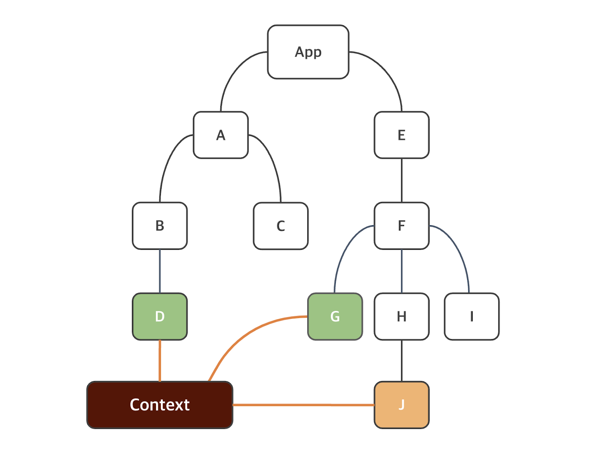

## review
- 객체 스프레드 연산자
- 객체 properties 를 업데이트하거나 복사할때 사용

```jsx
let user = {lastName : '김', firstName: '영', city : '부산'}

//파이썬의 딕셔너리와 같은방식
user ['age']= 20

user = {...user, school : '코리아 ~~~'}
```
기존에없는키를 추가

기존꺼는 그대로 두고 새로운값의 properties추가선언

`...객체명/배열명`의 경우 기본적으로 내부 element의 자료형과 property의 키 밸류 쌍을 고려할필요가잇다.

배열혹은 객체자체가아님.

- 객체를이용한 상태(STATE)

상태의 initialvalue를 객체 형태로 집어넣었을 경우 set객체명의 이용법은 다음과같다

```jsx
const [nema, setName]= useState({firstName:'영', lastName:'김'})
세터복습

setName({...name, firstName : '일'})

return<h1> Hello {name.firstName}</h1> //Hello 일  리턴

```

## 상태 비저장 컴포넌트(stateless Component)

props 를 argument 로 받아 리액트요소를 리턴하는 순수 js함수

```jsx
function HeaderText(props){
  return(
    <h1>{props.text} </h1>
  )
}

```
상위 컴포넌트에서 `<HeaderText text = '~~~'/>`

pure Component라고한다. 순수컴포넌트의 정의는 동일한입력값이주어졌을때 리턴되는 값이 일관되게 동일한 컴포넌트이다. 
이런 순수컴포넌트를 리액트에서는 성능최적화를하기 위해 React.memo() 라는것을 지원한다. 
예시
```jsx
function HeaderText(props){
  return(
    <h1>{props.text} </h1>
  )
}

export default memo(HeaderText)
;
```
컴포넌트가 랜더링된 다음 메모리제이션된다.
props가 변경되지않으면 메모된 결과를 랜더링한다. 즉 React.memo() 구문에서 랜더링조건을 사용자 정의하는데 이용할수있는 arePropsEqual()과 같은 argument도 존재하긴 하지만 다루지않는다. 다만 메모리제이션이라는 개념은 성능 최적화를 위해서 동일한 결과값이존재하면 고려할수잇음

# 조건부랜더링
```jsx
export default function MyComponent2(props) {
  const isLoggedin = props.isLoggedin // 

  if (isLoggedin){
    return(<Login />)
  }
    // 조건문의 if문에 해당실행

  return(<Logout/>)

}
```

## 삼항연산자활용
```jsx
import Login from "./Login";
import Logout from "./Logout";

export default function Mycomponent3({isLoggedin}){

  return(
    <>
    {isLoggedin ? <Logout/> : <Login/> }
    </>
  )
}
```


## React Hook

Hook 개념은 React 16.8 부터 도입되었다 함수 컴포넌트에서
상태와 리액트의 다른기능을 이용하는것이 가능하다. 훅이 생기기 전에는 컴포넌트 로직이 필요한 경우 클래스 컴포넌트를 써야했다.

# Hook 사용에서 중요규칙
1. 리액트 함수 컴포넌트 최상위 수준에서 Hook 을호출, 첫 번째 {} 내에서 호출하겠네요.

2. 조건문, 반복문, 중첩 함수 내에서 훅을 호출해서는 안된다.

3. 훅 이름은 use로 시작하며, 그 뒤에 훅을 이용하는 목적이 따라온다. 즉 useState라면 상태를 다루는 hook임을 명시했다고 볼 수 있습니다.


useState
App5.jsx 만들고 App.jsx에 있는 거 전부 잘라내기해서 붙여넣습니다.
App.jsx에는 초기화된 함수 컴포넌트를 만들어둡니다(<></>만 두겠습니다).
Counter.jsx를 만듭니다.
App.jsx에는 Counter 컴포넌트를 import 해두겠습니다.
```JSX
import { useState } from "react";


export default function Counter(){
  
  const [ count, setCount ] = useState(0);
  
  return (
    <div>
      <p>Counter = {count}</p>
      <button onClick={()=> setCount(count + 1)}>
        Increment
        </button>
    </div>

  );

}

```
- 상태를 선언하는데 사용되는 useState 함수를 활용하여 버튼을 누를때마다 count가 1씩 증가하는 예제작성
1. 리액트에서의 이벤트명은 카멜케이스(onClick)로 작성합니다. html 상에서는 onclick이었습니다. : 별개의 이벤트명이기 때문에 자동완성을 했을 경우 JS 변수를 불러올 수 있는 {} 가 생성되는 것도 확인할 수 있습니다.


2. `onClick={()=> setCount(count + 1)}` 에 주목
왜 `{SetCount(Count+1)}` 이 아닌지.......

- '함수'가 이벤트핸들러에 전달되어야하며 사용자가 버튼을 클릭할 때만 리액트가 함수를 호출해야한다 이상의 예제에서 function키워드로 함수정의한게 아닌 arrow function 을 통해 익명함수로 작성해봤음
이벤트핸들러 안에서 함수를 호출하게되면 컴포넌트가 랜더링될때 함수가 호출되어 무한루프가된다.


```jsx
<button onClick={()=> setCount(count + 1)}>  // 함수가 버튼을 눌렀을때 호출
클릭할때만 함수를 호출하기위해서


<button onClick ={SetCount(Count+1)}> // 함수가 렌더링 될때 호출되어 결과값이 바뀜 -> 상태가 바뀌었기 때문에 리렌더링 -> 함수가 호출되어 결과값이 바뀜 -> 상태가 바뀌었기 때문에 리렌더링이라는 무한루프


그때마다 함수를 호출하는... 
```

- 상태의 업데이트는 비동기적이므로 새 상태 값이 현재상태값에 달라질수있다. 최신값을 확보

이전의값을 무조건참조해서 입력

`<button onClick={()=> setCount(preValue =>preValue + 1)}>` 


*** app2 ***
  <button onClick={() => setCount((count) => count + 1)}>
          count is {count}
        </button>


### 일괄처리 
- Counter2 만들겠습니다.
- App.jsx의 Counter 컴포넌트 밑에서 Counter2 컴포넌트를 불러오겠습니다.
- Counter2에는 count1 상태와 count2 상태를 각각 선언하고, 둘 다 0으로 초기화하겠습니다.
- Counter2의 return문은 이하와 같습니다.

```jsx
import { useState } from "react"

export default function Counter2(){

  //초기값 0으로 count1, count2 초기선언
  const [count1, setcount1] = useState(0)
  const [count2, setcount2] = useState(0)
  
  const increment = () => {
    setcount1(count1+1); // 아직 재랜더링이 일어나지않는다
    setcount2(count1+1); // 모든 상태가 업데이트되고 나서 재랜더링된다.

  }

  return(
    <>
      <p>Counters : {count1} | {count2} </p>
      <button onClick={increment}>증가</button> 
    </>
  )
}

```
- 일괄처리가 버튼 클릭 같은 브라우저 이벤트 중 일부에서만 가능했다 즉, 위의 코드에서 
setCount() 가 호출되는 시점에서 count1의 상태가변경되었기 때문에 기존에 알던 상태 state정의에서
재랜더링이 일어나야지만 
onClick이벤트 중이기 때문에 재랜더링이 일어나지않았고 setCount2()까지 호출되고 나서야 전체 컴포넌트가 재랜더링 수행되었다...


- 일괄처리를 하고싶지않은 경우에만 커스텀해야하는데 flusgSync API 라는것을 추가로 사용하는데 이를 이용할 경우 다음상태를 업데이트하기전에 일부 상태하려는 경우가있을수 있는데 보통
브라우저 API와 같은 서드 파티 코드를 합칠때 유용하게사용된다. 

### user Effect
- 함수 컴포넌트에서 보조작업을 수행하는데 이용한다.
주로 사용하는것은 fetch요청에서.
jsonplaceholder에서 학습


- 형식
`useEffect(callback, [dependencies])`
- 첫번째 argument인 callback 함수는 보조 작업 로직이 포함되어있으며  [dependencies]는 의존성을 포함하는 배열로 optional입니다.
[dependencies]는 의존성을 포함하는 배열로 optional이다.


-Counter3.jsx를 생성하고, Counter의 내용을 그대로 붙여넣기 합니다.

-App.jsx에서 Counter3 컴포넌트를 가장 상위에서 불러오도록 하겠습니다.

```jsx
import { useCallback, useEffect, useState } from "react";


export default function Counter3(){
  
  const [ count, setCount ] = useState(0);
  
  useEffect(() => console.log('Hello'))


  return (
    
    <div>
      <p>Counter = {count}</p>
      
        <button onClick={()=> setCount(preValue=>preValue + 1)}></button>
        증가
        
    </div>
    
    
  );

}
```

` useEffect(() => console.log('Hello'))`
두번째 argument() 가 없는 상태. 따로 dependencies 가 없는 상태이므로 userEffect()를 안썼을때와 동일하다. 재랜더링이 일어날때마다 첫번째 argument인 callback 함수가호출된다. 
개발자도구의 console에서확인가능

- useEffect 에는 콜백함수가 _모든 랜더링에서 실행되는게아닌 선택적으로 실행할수있는_ 의존성배열을
두번 째 argument로 갖는다. 이하의 예시는 count상태값이 변경되면 즉, 이전값과 현재 값이 달라지면 
useEffect 가 호출될수있도록 정의한다 그리고 두번째 argument는 배열이기 때문에 
내부에 여러 상태를 정의하는것도가능.
그 중 상태값 하나라도 변경되면 useEffect훅이 호출된다.

-  `useEffect(() => console.log('Hello from useEffect'),[count])`
count상태가 바뀔때마다 useEffect() 내의 callback함수가호출

- 근데 의존성배열 없을 때랑 별반 차이가 없어서 Counter4에서 명시적으로 볼 수 있게끔 작성해보겠습니다.
- 특정상황에서 랜더링이일어나고 
아닐떄 

주식정보.... 
상태값이바뀌더라도
리랜더링이 안일어나면좋겟다 


count4 에서 명시적으로 -  `useEffect(() => console.log('Hello from useEffect'),[count])`
count상태가 바뀔때마다 useEffect() 내의 callback함수가호출
하는것을보여줌
```jsx
import { useEffect, useState } from "react";

export default function Counter4(){
  const [count1, setcount1] = useState(0);
  const [count2, setcount2] = useState(0);

  useEffect(() => {console.log('coun1만 변경되었음')}, [count1] );


  return(
    <>
    <p>Count : {count1} | {count2}</p>
    <button onClick={()=> setcount1(preValue=>preValue + 1)}>숫자증가1</button>
    <br />
    <br />
    <button onClick={()=> setcount2(preValue=>preValue + 1)}>숫자증가2</button>
  </>
  )


}
```

[] 비어있는 객체 삽입

막아야한다 
useEffect안에넣어둔다
  useEffect(() => {console.log('첫번째 랜더링시에만 callback함수가 호출됩니다. 나머지는 안나옴')}, [count1] ,[] );

useEffect는 인자를 딱 두 개만 받습니다. (함수, 배열) 이렇게요!
```jsx
특정 값이 바뀔 때만: useEffect(() => { ... }, [count1])

처음 한 번만: useEffect(() => { ... }, [])
```
둘 다 하고 싶을 때: 보통은 각각의 목적에 맞게 useEffect를 두 번 써줍니다.


-----정리-------------------------------------

useEffect(() => {console.log('count1 상태가 변경되었습니다. count2가 바뀌는건 신경쓰지 않습니다.')}, [count1]); - 이 경우 count2의 상태값이 바뀌었을 때는 재렌더링이 일어나지않지만, count1이 바뀔 때는 변경됩니다.

useEffect(() => {console.log('첫 번째 렌더링시에만 useEffect의 callback 함수가 호출됩니다. 나머지는 이 내용이 콘솔에 다시 안나옵니다.')}, []);


-------------------------------------


## useRef 
- DOM 노드에 접근하는데 이용할수있는  _변경가능한 ref객체_ 를 return한다

- 형식
`const ref = useRef(initialValue);`

- return 된 ref 객체에는 전달된 argument로 초기화된 현재 속성이 있다.
inputRef 라는 ref객체를 생성한 다음 null로 초기화 . 다음 json 요소의 ref속성 이용, 
input요소의 focus함수를실행


-App6.jsx 만들고 App.jsx 내용 전체 복사합니다.

-App.jsx는 초기화를 합니다.


클릭했을때만 나와야하니 익명함수쓴다

```jsx

import { useRef } from 'react';
import './App.css';

export default function App(){

const inputRef = useRef(null); 

  return(
    <>
    <input type="text" ref={inputRef} />
    <button onClick={() => inputRef.current.focus()}>Focus Input</button>
    </>
  );
}
```


## custom Hook
- 사용자정의 함수

리액트에서 사용자 정의 훅 함수를 정의하는 것이 가능합니다. Hook의 조건에서처럼 use로 시작해야하며, 기본적으로는 JavaScript 함수입니다. 그리고 여태까지 배운 것처럼 함수 내에서 다른 함수를 호출할 수 있듯이 hook 내에서 다른 hook을 호출하는 것도 가능합니다. 이를 이용하면 컴포넌트의 복잡성을 줄이고 재사용성이 늘어날 수 있습니다.

예시 확인하겠습니다. title 태그의 값을 바꾸는 DOM 조작 관련 훅 함수를 생성하겠습니다. 그러면 useTitle이라는 이름이 되어야겠네요.

- useTitle.js 생성하겠습니다.
- Counter5.jsx 만들겠습니다. App.jsx 상위에 Counter5 컴포넌트를 불러오겠습니다.
```jsx
import { useEffect } from "react";

function useTitle(title) {
  useEffect(()=>{
    document.title = title;
  },[title]);
}
export default useTitle;
```
호출시에 받은 매개변수 title이 변경 될때마다 해당 index.html의 title 태그의 값을 재대입해줍니다.
useTitle이라는 사용자 정의 hook 내부에서 useEffect()라는 미리 정의되어진 hook을 호출했습니다.

```jsx
import { useState } from "react";
import useTitle from "./useTitle";

export default function Counter5() {
  const [count, setCount] = useState(0);
  useTitle(`당신은 ${count} 번 클릭했습니다.`);

  return(
    <>
      <p>Counter : {count}</p>
      <button onClick={() => setCount(preValue => preValue +1)}>Increment</button>
    </>
  );
}
```
정의는 .js 파일에 해놓고, 호출은 Counter5.jsx에서 했습니다. useTitle은 title이라는 매개변수를 가지기 때문에 이를 템플릿 리터럴을 통해서 argument로 보냈습니다. 혹시 복잡하게 쓰고 싶다면
const title = `당신은 ${count} 번 클릭했습니다`;
useTitle(title);
로 clean code 작성하셔도 무방하겠습니다.


## Context API
- 원리는 중요하지만 Zustand

- 트리구조를 따른다. 상위 컴포넌트에서 하위 컴포넌트로 props를 전달해주는 형태.
트리 구조가 4단으로 이루어져있는데 상위에서 props를 전달하고 가장 하위에서 이를 return에서 풀어준다했을 때 2,3 단의 컴포넌트들은 props를 전달받아야한다.

리액트에서 props 전달을 2,3단으로 하는 것이 불가하기때문 
이를 해결하위한 방식이 context api





-특정정보는 context에서 모아서 꺼내서쓰는경우 전역데이터 관리법


자바스크립트파일
```jsx
import { createContext } from "react";

const AuthContext = createContext('');

export default AuthContext;
```


리액트 앱 파일
```jsx

import './App.css'
import MyComponent from './MyComponent'
import AuthContext from './creatContext';

function App() {

  const username = 'kim0';

  
  return (
    <>
      <AuthContext.Provider value={username}>
        <MyComponent/>
      </AuthContext.Provider>
    </>
  )
}

export default App

```
리액트 마이컴포넌트 파일
```jsx
import { useContext } from "react";
import AuthContext from "./creatContext";


export default function MyComponent(){

  const authContext = useContext(AuthContext)

  return(
    <p>
    welcome {authContext}
    </p>
  );


}
```

context api를 사용하기위한 예시
그런데 App에서 받은 변수인 username을 Hello에서 풀어야 합니다. 그 말은 MyComponent에서는 안쓸거지만 username 변수를 받아야 한다는 것을 의미합니다. -> 여기서 우리가 알 수 있는 점은 상위 컴포넌트에서 하위 컴포넌트로 DataFlow가 일어나는 건 맞는데, 한 번에 두 칸 내려가는 것도 불가능하고 한 칸 한 칸씩 넘겨줘야 함을 의미합니다.


앱 마이컴포넌트 헬로우
-> 1단


->2단
앱 자바스크립트

```jsx

import './App.css'
import MyComponent from './MyComponent'


function App() {

  const username = 'kim0';

  
  return (
    <>
      <MyComponent username = {username}/>
    </>
  )
}

export default App


```

마이컴포넌트
```jsx
import Hello from "./Hello";


export default function MyComponent(props){
  const name = props.username;

  return(
    <>
    {name} 님 <br />
    <Hello username = {name}/>
    </>
  );

}
```


헬로우
```jsx

export default function Hello(props){

  return(
    <>
    안녕하세요, {props.username}
    </>
  )
}
```


## React List
- 맵 함수


-----------복습----------------
전역관리
-
useRef,usestate, useEffect, context api ****!!!!
ContextAPI 제외 다른 3rd - party관리방식
복습...

