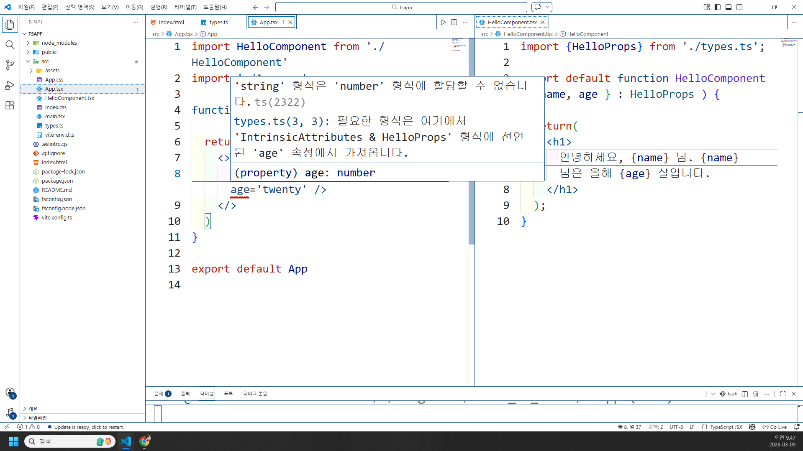
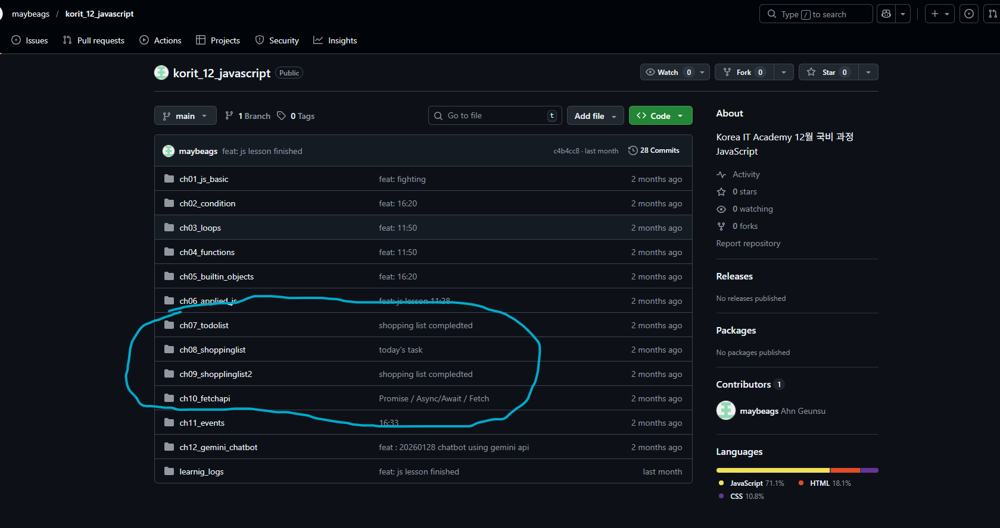

# 리액트에서 타입스크립트이용
State / Props
- ts를 적용했을때 컴포넌트 프롭의 타입을 정의해야한다. 
ts를 적용했을때 프롭의 타입을 정의하기위해 type또는 interface를 이용가능.

- HelloComponent.tsx를 생성하고 임시 string data만 return하세요. App.tsx에서 HelloComponent를 집어넣으세요.
```tsx
export type HelloProps = {
  name: string;
  age: number;
}
```
 types.ts를 통해 자료형들을 전부 명시해둡니다
```tsx
// App.tsx
import HelloComponent from './HelloComponent'
import './App.css'

function App() {

  return (
    <>
      <HelloComponent name='김영' age='twenty' />
    </>
  )
}

export default App

// HelloComponent.tsx
import {HelloProps} from './types.ts';

export default function HelloComponent({ name, age } : HelloProps ) {

  return(
    <h1>
      안녕하세요, {name} 님. {name} 님은 올해 {age} 살입니다.
    </h1>
  );
}
```



- App.tsx에 빨간줄이 떠있기는한데 브라우저에 값이 출력된다. 
타입스크립트가 jsx의 보조이기 떄문에 경고만띄운상태에 해당.
 즉 브라우저를 켜기 전에 잠재적인 오류를 잡아낼 수 있도록 하는 것이 TypeScript의 첫번째 존재 이유


```ts
export type HelloProps = {
  name: string;
  age?: number;
}
```

로 수정하면  <HelloComponent name='김영'  /> 이라고하면 오류발생x

?를 붙이지않더라도 브라우저 자체가 출력이안되는일이 없다.

- jsx와 차이중하나는 React+js의 경우 빨간줄 뜨는 순간 브라우저 창에 경고창 뜨는데  ts는 잠재적오류를 브라우저 실행 전 포착하는 것이 목표이기때문에 그것이
jsx상의 문법적오류가이니라면 출력된다.

```ts
// 매개변수 없음call  1
export type = {
  name = string;
  age? : 20;
  fn : () => void;
}

//매개변수있음 call3
export type = {
  name : string;
  age? : 20;
  fn : (msg: string) => void;
}

```

props타입을 정의하는방법

state관련...
useState()를 생각해보시면 내부의 initialValue가 뭐냐에 따라서 추후 상황이 결정
```tsx

// 문자열 초기값
const [name, setname] = useState('');

// 숫자 초기값
const [age, setage] = useState(1);
// boolean 초기값
const [isready, setReady] = useState(false);

```
`setAge('ten')` 이라고하면 입력오류.

타입추론을한다. 즉 자료형은 number int라고 타입추론을했는데 
`setAge('ten')` 이렇게하면 string이어서 오류이다. initialValue타입추론.


```tsx
const [age, setAge] = useState(0);

  // initialValue 와 다른매개변수호출
  setAge('ten')
```

js상에서의 문제발생
타입추론을 통한 매개변수가 number임에도 불구하고 함수의 매개변수가 string이기 때문에 타입 불일치로 인한 브아주거 return이 실패.
react hook은 jsx에서도있었기 때문, 결과값 안나옴.

- 상태의 타입을 명시적으로 정의하는것도 가능 상태를 null이라고하거나 undefuned로 초기화하려면 요구된다. 
'' 안쓰고 null쓰려면 ts가 필요

```tsx
// useState안에 제네릭을씀 
// usestate의 argument로 string 이나 undefined로 들어간다.
const [message,setMessage] = useState<string | undefined>(undefined);
```
함수에서 매개변수 타입의 명시적 정의와 방식이 다르다. 그 이유는  useState라는 react hook이 tsx에서만 적용되는것이 아니고 이미 정의된 함수를 호출하여 message/setmessagfe배열을 return한 것이기때문. 
`함수명(매개변수1: 'string', 매개변수2: number): void`
와 같은 방법이아닌 제네릭을씀 `<>` ts와 react 가 결합된 tsx의 문법.

- 상태가 하나짜리일때 가깝다. 다수의 타입을 명시해여ㅑ한다면 type/ interface를 씀

```tsx
type User ={
  id :number;
  name: string;
  age: number;
}

export default Example1(){
  const [user, setUser] = useState<User>({});

  //null가능
  const [user, setUser] = useState<User | null>(null);


}

```
App2.tsx 생성하고, App.tsx의 내용을 옮기고 App.tsx는 초기화하세요. -> css 는 남기겠습니다.

Review.tsx 컴포넌트를 생성-임시-하고, App.tsx에 불러오세요.

현재 제출 버튼 누르고 나서도 input 창에 여전히 값이 남아있는게 불편합니다. 제출 버튼 누르고 나서는 사라졌으면 좋겠어요. 어떻게 할지 고민해보겠습니다.(todolist에서 했습니다)


# React RestFul Api

- Promise

- fetch api

- Axios 라이브러리 


## promise 
- 비동기 연산을 처리하는 고전적인 방법은 연산의 성공또는 실패에 콜백함수 달아주기
연산이 성공했을 경우 success가 호출되고 , 실패하면 
failure함수가 호출된다. 

```tsx
function doAsyncCall(sucess, failure){
  if(SUCCEED){
    success(resp);
  }else{
    failure(err);
  }
}

function success(response){
  //응답을 가지고 수행하는 로직
}

function failure(error){
  //오류처리로직작성
}

//함수호출
doAsyncCall(success, failure);

```
- 이상의 예시는 promise가 도입되기 전 방식. 
Promise는 js에서 비동기 프로그래밍의 기본요소에 해당한다.

- promise의 정의  : 비동기연산의 결과를 나타내는 js객체. 이를 이용하면 성공 실패에 대한 함수를 일일이 정의하지않아도된다. 코드가 단순화된다.
콜백이 중첩되지않기 때문에 callback hell을 겪지않음.


```js
doAsyncCall().then(responce => //)

```
then() 메서드는 prominse객체를 return한다. 
이는 promise세가지 상태 중 하나에 해당한다.
1. pending : 초기 상태
2. resolved / fulfilled : 작업성공
3. rejected 거부 : 작업실패

```js
const myPromise = new Promise((resolve, reject) => {
  setTimeout(() => {
    resolve('Hello'); // 'Hello'라는 것으로 무언가수행 , 정의x


  }, 500)

});
```
- promise 객체가 생성될 때와 타이머가 실행되는 동안에 promise는 대기 상태에 있음
500 밀리초가 지나면 Hello라는 값으로 resolve함ㅅ가 호출되고 
promise는 이행상태가된다. 만약오류 발생하면 .then을 쓰지는 않지만 
promise상태가 거부도ㅓㅣㄴ다.

.then() 메서드를 통해 인스턴스를 서로 연결하여 다수의 비동기작업을 순차적으로 진행시킴

```js
doAnsyncCall()
  .then(response => // 응답에서 일부데이터만 가지고오기 ex ) 
  .then(data => //그 가지고온 데이터를 가지고 브라우저에 뿌리는로직.)
```


- 오류발생시에 promise에 오류처리를 추가할수있다.

```js
doAsnyncCall()
  .then(responce =>)
  .then(data =>)
  .catch(error => console.log(error)) // 
```

## async / await
전에했음 참고 


- 비동기 호출을 처리하는 .then() 보다 더 최신방법

```js
const doAsyncCall = async () => {};
  const response = await fetch(`http://sample.com`);
  const data = await response.json();
  // 그 다음 정의된 data  변수를 가지고 무언가수행하기.
```

- fetch() 함수 자체도 리턴타입이 promise객체이다. 
promise가 return임에도.  .then()메서드를 사용하는게아닌 `await`키워드를사용함,

- promise가 처음 도입되었을때 시간적 차이를 나타내기위해 
then()이라는 접속사를 활용한 메서드를 정의. 이후 발전 과정에서 기존의 js문법으로 표현을 할 필요성을 느껴서 `async/ await`  키워드를 추가개발함.

- .then() 를 도입했다면 : 체이닝 메서드를 통한 순차처리를 예시로코드를 작성
- async / await 를 도입하면: 비동기처리를 하는 함수를 동기적으로작성 

덴메서드를통해 비동기처리를 체이닝메서드로연결 그게 기존 자바스크립트


## fetch api 
- fetch api 는 라이브러리 설치 필요 x
- fetch api 는 호출하는 리소스 경로를 필수 argument로 갖는 fetch() 메서드를 가지고있다. 웹 요청의 경우 argument로 서비스의; url 될것이다
응답을 요청ㅇ하는 반환하는 get요청

```tsx
// 특정 
fetch(`https:// someapi.com / ${id}`)
    .then(response => response.json())
    .then(data => console.log(data))
    .catch(error => console.log(error))


```
- 첫번쨰.fetch 문에 전달되는 response는 요청이 성공했는지 확인하는 데 이용할수있는 ok및 status 속성을 포함하는 promise객체. 
응답이 2xx형식이면 ok 속성값은 true

```tsx
fetch(``)
  .then(response=>{
    if(response.ok){

    }
    else{

    }
  })
  .then(response => response.json())
  .then(data => console.log(data))
  .then(error => console.log(error));
```

post 요청과 같은 http메서드를 이요하려면 fetch()메서드의 두 번째 argument가 
필요하다. 두번째 argument는 여러 요청을 정의할수있는 `객체`이다. 

post요청

```tsx


fetch(`https:// someapi.com` , {method:post})
    .then(response => response.json())
    .then(response => response.json())
    .then(data => console.log(data))
```


```tsx
fetch(`https:// someapi.com` , ){
  method: 'post',
  headers: {'Content-type' : 'application/json'}
  .then(response => response.json())
  .then(data => console.log(data))
  .then(error => console.log(error));

}


```


```tsx
fetch(`https:// someapi.com`, //jsonplaceholder , todolist, postman
  {
    method: 'post', // 
    headers: {'Content-type' : 'application/json'}, 
    body : json.stringfy(data) // 
  }
)
```


### axios라이브러리
- 지금 then() 메서드가 promise 에서도 쓰이고 fetchapi 에서도 작성되었다.
.then() 대신에 async/await를 도입할수있다. 
fetchapi는 http 메서드들을 처리하기위한 api로 대체하기위한 라이브러리에 해당. 

- .then() 대신 async/await를 쓰지만 

fetch api 의 불편함을 일부 대체하는 외부 라이브러인 axios를 도입하기위한것
`npm install axios`
추가 라이브러리

외부 라이브러리인 axios 및 내부 라이브러리인 fetch api 활용


- post 요청 예시.
```jsx
axios.post(`https:// someapi.com`, {newObject})
    .then(respose => console.log(response))
    .then(error => console.log(error));
```
- 이상이  axios + then ()메서드


```jsx
const response = await axios({
   method : 'post',
   url: 'http://myapi.com/api/cars'
   headers: {'Content -Type ':' application/json'}
   data: {brand: '현대' , model : '소나타'}
})
```

- 일단 async가 정의되어있지않기 때문에 그냥 형식의 참조자료에해당.
axios에  .get()  / .post()가 아닌 axios 자체에서 argument로 js객체 형태를 보내줬다.  -> json으로 안바꿈... 


- 한줄 줄어든다. axios사용 후 fetch api 전

fetch api, then, axios, await..async, 정리

1. 날씨 앱.  생성후  app.jsx초기화

2. fetch()의 결과를 state로 저장.  -> fetch() 의 결과는 기본적으로 promise의 객체이고 이를  .then을 쓰든 async/await를 쓰든 json까지 

변수와. state    ,...   state 리랜더링을일으킨다


```jsx

import { useState } from 'react'
import './App.css'

function App() {
  const [weather, serWeather] = useState({
    temp: '',
    desc: '',
    icon: '',
  });

  return (
    <>
      
    </>
  )
}

export default App

```

3. 외부 api이용
부산or서울 날씨보여주는 리액트앱구현
온도 temp 설명 desc 날씨 아이콘 icon 포함시킬것이기때문에 날씨데이터외부앱
http://openweathermap.org

4. api key를 발급받은 뒤의 api 앤드포인트로 들어가야함.
http://api.openweathermap.org/data/2.5/weather?q=Busan&units=Metric&APIkey=384996904b70326d25f72a69d9474f91


json으로 보여지는 날씨 api키값들
```jsx
{
  "coord": {
    "lon": 129.0403,
    "lat": 35.1028
  },
  // list의 자바스크립트객체 [{}]
  "weather": [
    {
      "id": 800,
      "main": "Clear",
      "description": "clear sky",
      "icon": "01d"
    } // {}자체가 자바스크립트 객체인 배열 0번지이다.
  ],
  "base": "stations",
  "main": {
    "temp": 10.99,
    "feels_like": 8.98,
    "temp_min": 10.99,
    "temp_max": 10.99,
    "pressure": 1023,
    "humidity": 32,
    "sea_level": 1023,
    "grnd_level": 1018
  },
  "visibility": 10000,
  "wind": {
    "speed": 6.17,
    "deg": 310,
    "gust": 11.32
  },
  "clouds": {
    "all": 0
  },
  "dt": 1773033600,
  "sys": {
    "type": 1,
    "id": 8086,
    "country": "KR",
    "sunrise": 1773006223,
    "sunset": 1773048333
  },
  "timezone": 32400,
  "id": 1838524,
  "name": "Busan",
  "cod": 200
}

```

5. json결과값을 확인했을때 기온/설명/icon에 해당하는 값들을 들고오기위해 json의
특정 key의 value의 자료형이 무엇인지 확인하는 것이 중요 함. 

예로 temperature의 경우 `main['temp']`로 작성하면 된다.  하지만 description의 경우 icon이  weather의 value가 배열이고 거기의 0번 element가 js객체라는것을확인할수있다. 
결과적으로 icon의 값을 프론트앤드 상태에 저장하기위해 
`weather[0].icon` 이거나  ------- 

`weather[0]['icon']`으로 되어야함..

- **첫 렌더링 시에** fetch()를 시도해서 그 값으로 고정시킴. 

상태가 바뀔때마다 확인이 아닌 
`useEffect(()=>{},[])` 에서 [] 여기가 그 부분을 통제한다

- 첫 렌더링 시에 
useEffect() 내부의 콜백함수에서 setWeather() 함수를 호출해서 값을 대입해야겠음.
useEffect()의 콜백함수에서 fetch() 를 수행, 
promise객체가 나오면 개를 json으로 바꿔준다.

그 json 값에서 필요한 key-value조합을 꺼낸다음 상태에 저장.

콜백함수에 ()=> 

fetch api 적용 파트복습이라생각


```jsx

import { useEffect, useState } from 'react'
import './App.css'

function App() {
  const [weather, setWeather] = useState({
    temp: '',
    desc: '',
    icon: '',
  });

  useEffect(()=>{
    fetch(`https://api.openweathermap.org/data/2.5/weather?q=Busan&units=Metric&APIkey=384996904b70326d25f72a69d9474f91`)
    .then(response=> response.json())
    .then(data=> {
      setWeather({  
          temp: data.main.temp,
          desc: data.weather[0].description,
          icon: data.weather[0].icon
      })
    })
    .catch(err => console.log(err));
  },[]);
  // useEffect 해석 중요


  
  return (
    <>
      
    </>
  )
}

export default App

```
- 특히 userEffect() 부분 전체에 해당하는 부분을 해석해볼만한 가치가있다.
어디까지가 useEffect()의 영역인지 해석.

6. icon을 확인하면 기본적으로 string자료형임 그림이 아님
즉 날씨 아이콘을 추가해야함 
`http://openweathermap.org/img/wn/` 마지막에 endpoint로 


```jsx

import { useEffect, useState } from 'react'
import './App.css'

function App() {
  const [weather, setWeather] = useState({
    temp: '',
    desc: '',
    icon: '',
  });

  useEffect(()=>{
    fetch(`https://api.openweathermap.org/data/2.5/weather?q=Busan&units=Metric&APIkey=384996904b70326d25f72a69d9474f91`)
    .then(response=> response.json())
    .then(data=> {
      setWeather({  
          temp: data.main.temp,
          desc: data.weather[0].description,
          icon: data.weather[0].icon
      })
    })
    .catch(err => console.log(err));
  },[]);
  // useEffect 해석 중요
  if (weather.icon){
    return (
    <>
      <p>기온: {weather.temp}℃</p>
      <p>설명: {weather['desc']}℃</p>
      <p>아이콘 string : {weather.icon}</p>
      
    </>
  )
  }else{
    return <h1>Loading... 🕛 </h1>
  }


  
}

export default App

// 'desc' 작은따옴표 주의

```
조건부 랜더링까지완료

- fetch api 활용 -> then활용  -> useEffect() / useState() -> json데이터분석: 특정 키의 value의 자료형의 따라서 상태에 저장하는 방식이 달라진다.

```jsx

import { useEffect, useState } from 'react'
import './App.css'

function App() {
  const [weather, setWeather] = useState({
    temp: '',
    desc: '',
    icon: '',
  });

  useEffect(()=>{
    fetch(`https://api.openweathermap.org/data/2.5/weather?q=Busan&units=Metric&APIkey=384996904b70326d25f72a69d9474f91`)
    .then(response=> response.json())
    .then(data=> {
      setWeather({  
          temp: data.main.temp,
          desc: data.weather[0].description,
          icon: data.weather[0].icon
      })
    })
    .catch(err => console.log(err));
  },[]);
  // useEffect 해석 중요
  if (weather.icon){
    return (
    <>
      <p>기온: {weather.temp}℃</p>
      <p>설명:ㅁ {weather['desc']}맑은하늘입니다.</p>
      <p>아이콘 string : {weather.icon}</p>
      
    </>
  )
  }else{
    return <h1>Loading... 🕛 </h1>
  }


  
}

export default App

// 'desc' 작은따옴표 주의


```