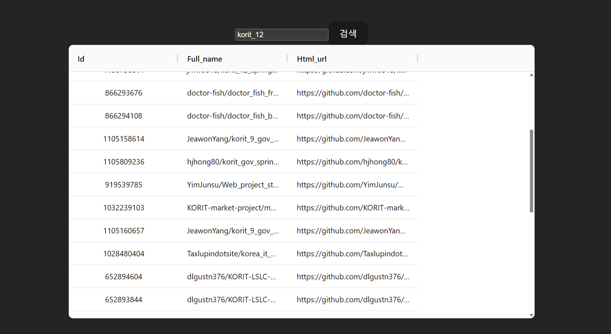

# AG Grid
- 리액트 앱용 데이터 그리드 컴포넌트.
스프레드 시트처럼 데이터를 표시하는데 이용. 필터링, 정렬, 피벗 (엑셀 피벗테이블과 유사)

`npm install ag-grid-community@30.0.1 ag-grid-react@30.0.1`

```jsx

import { useState } from 'react';
import axios from 'axios';
import { AgGridReact } from 'ag-grid-react';
import 'ag-grid-community/styles/ag-grid.css'
import 'ag-grid-community/styles/ag-theme-material.css'

import './App.css'

type Repository = {
  id: number; // 고유값을 통해서 나중에 .map() 적용했을 때 사용
  full_name: string;
  html_url: string;
};

function App() {
  const [ keyword, setKeyword ] = useState('');
  const [ repodata, setRepodata ] = useState<Repository[]>([]);

  const handleClick = () => {
    axios.get<{ items: Repository[] }>(`https://api.github.com/search/repositories?q=${keyword}`)
      .then(response => setRepodata(response.data.items))
      .catch(error => console.log(error));
  }

  return (
    <div className='App'>
      <input type="text" onChange={e => setKeyword(e.target.value)} value={keyword}/>
      <button onClick={handleClick}>검색</button>
      <div className='ag-theme-material'
        style={{height: 500, width:850}}
      >
        <AgGridReact
          rowData={repodata}
        />
      </div>
      </div>
  )
}

export default App
```

-- 이부분을 보면  <AgGridReact
          rowData={repodata}
        /> 
ag-grid의 컴포넌트에 데이터를 채우려면 컴포넌트에 rowData프롭을 전달해줘야한다.
객체의 배열을 데이터에 넣을수있기에 state에 해당하는 기존에만든 repodata를 이용할수있다. 
```tsx
 <div className='App'>
      <input type="text" onChange={e => setKeyword(e.target.value)} value={keyword}/>
      <button onClick={handleClick}>검색</button>
      <div className='ag-theme-material'
        style={{height: 500, width:850}}
      >
        <AgGridReact
          rowData={repodata}
        />
      </div>
      </div>
```
하필 귀찮게 div로 감싸줘야하나...

- 오류 발생 수정
현재 ag-grid-community와 ag-grid-react가 버전 불일치가 확인되었슴.
1. package.json 에서 의존성파트애서 ag-grid 관련 두개다 삭제
2. node-module에서 ag-grid 관련폴더 두개삭제
3. npm instal ag-grid-community ag-grid-react
4. vite프로젝트가 cache를 가지고잇어서 이전설정을 그대로 메모리에 가지고잇는다.
- node-modules의  .vite를 전체삭제.
5. 

```tsx
{
  "name": "restgithub",
  "private": true,
  "version": "0.0.0",
  "type": "module",
  "scripts": {
    "dev": "vite",
    "build": "tsc && vite build",
    "lint": "eslint . --ext ts,tsx --report-unused-disable-directives --max-warnings 0",
    "preview": "vite preview"
  },
  "dependencies": {
    "ag-grid-community": "^35.1.0",
    "ag-grid-react": "^35.1.0",
    "axios": "^1.13.6",
    "react": "^18.2.0",
    "react-dom": "^18.2.0"
  },
  "devDependencies": {
    "@types/react": "^18.2.15",
    "@types/react-dom": "^18.2.7",
    "@typescript-eslint/eslint-plugin": "^6.0.0",
    "@typescript-eslint/parser": "^6.0.0",
    "@vitejs/plugin-react": "^4.0.3",
    "eslint": "^8.45.0",
    "eslint-plugin-react-hooks": "^4.6.0",
    "eslint-plugin-react-refresh": "^0.4.3",
    "typescript": "^5.0.2",
    "vite": "^
    .5"
  }
}
```


```tsx
import { useState } from 'react';
import axios from 'axios';
import { AgGridReact } from 'ag-grid-react';
import { ColDef } from 'ag-grid-community';

import './App.css'

import { ModuleRegistry,AllCommunityModule,themeQuartz } from 'ag-grid-community';
ModuleRegistry.registerModules([AllCommunityModule]);

type Repository = {
  id: number; // 고유값을 통해서 나중에 .map() 적용했을 때 사용
  full_name: string;
  html_url: string;
};

function App() {
  const [ keyword, setKeyword ] = useState('');
  const [ repodata, setRepodata ] = useState<Repository[]>([]);
  const [ columnDefs ] = useState<ColDef[]>([
    {field: 'id'},
    {field:'full_name'},
    {field:'html_url'}
  ]);
  const handleClick = () => {
    axios.get<{ items: Repository[] }>(`https://api.github.com/search/repositories?q=${keyword}`)
      .then(response => setRepodata(response.data.items))
      .catch(error => console.log(error));
  }

  return (
    <div className='App'>
      <input type="text" onChange={e => setKeyword(e.target.value)} value={keyword}/>
      <button onClick={handleClick}>검색</button>
      <div className='ag-theme-material'
        style={{height: 500, width:850}}
      >
        <AgGridReact
          rowData={repodata}
          columnDefs={columnDefs}
          theme={themeQuartz}
        />
      </div>
      </div>
  )
}

export default App
```

version up 을 (30->35)로 반영한 AG grid관련코드

- 기본적으로 table형태(grid)를 확인할수있는형태.


- sorting/filtering기능을 추가

- ColDef 관련 properties 
현재는 field/sortable
사이트첨부


- 이상까지가 pagination적용버전 
html-url등을 가지고온이유가 `<a>`태그 적용을 통해 클릭하면 해당 페이지로 넘어갈수 있게끔 하는것.
repodata에 있는 html_url 의 자료형인 string데이터를 그대로가져와서 현재의 ag-grid는 링크가작동하지;않음
- 
이를해결하기위한
cellRender프롭을 이용하여 grid의 셀 컨텐츠 커스텀하기

```tsx
const [ columnDefs ] = useState<ColDef[]>([
    {field: 'id, sortable:false, filter: true'},
    {field:'full_name, sortable:true, filter: true'},
    {field:'html_url, sortable:true, filter: true'},
    {
      field: 'full_name',
      //매개변수명 자료형 aggrid내부에잇는친구를가지고온것, 
      cellRenderer: (params: ICellRendererParams)=> (
        <button
          onClick={()=> alert(params.value)}
        >
          prees up ❤️
        </button>
      )
    }
  ]);
```

- 네번째 column을 만들었고 여태까지 json데이터를 default값으로 가져왔기때문에 
string데이터의 형태로만 봤을때 html태그를 집어넣는 방식으로 커스텀하기위해 
1-3번 컬럼과는 cellRender라는 key-value property를 이용했고 
내부에서 button태그를 만들었다 onclick등의 이벤트를 이용할수잇고 
클릭할때만 함수가 작동해야해서 화살표함수응용

- 


//// mui 처음학습
# Material UI 컴포넌트이용라이브러리 - Shopping list 
- MUI 구글의 material디자인언어를 구현하는 리액트 컴포넌트 라이브러리.
내부에 /list/table/card등의 다양한 컴포넌트가 있어서 균일한 사용자 인터페이스를 구현할수잇음.

```tsx
import { Container,AppBar, Toolbar,Typography } from '@mui/material'
import { useState } from 'react'
import './App.css'

function App() {


  return (
    <>
    <Container>
    <AppBar position='static'>
      <Toolbar>
        <Typography variant='h6'>
          Shopping list
        </Typography>
      </Toolbar>
    </AppBar>
    </Container> 
    </>
  )
}

export default App
```
새로운 컴포넌트 작성햇음
1. container : MUI의 기본 레이아웃 컴포넌트 컨텐츠를 가로 중앙에 배치하는 데 이용.
내부에 PROP으로 maxWidth 프롭을 이용하여 컨테이너 최대 너비를 지정할수있다. 기본값은
'lg'이다. mui는 숫자를 값으로 받기도 하지만 lg와 같은 방식으로 string축약어를 값으로 받기도한다.
2. typography : 미리 정의된 텍스트 크기를 제공하며 해당 예시에서는 h6이라는 값을 variant프롭으로 전달했는데 이는 mui가 적용된 `<h6>` html태그를 쓴것과 같은 효과를 낸다. 일일이 다른 html 태그를 외울것이 아닌 글자를 쓴다면 `<Typography>`를 일단 자동완성으로 작성하고 다음 props형태로바꿀수잇음.


- ADDItem component 생성. 단일 input창과button을 이용해서 todolist나 github repository검색을 했던 것과 달리 다수의 컴포넌트들이 합쳐져서 하나의 페이지를 만드는 것을 연습.

shoppinglist에서 Modal을 이용. 두개의 input창과 additem함수를 호출하는 버튼을 추가. App.tsx에 addItem() 함수를 정의해놨기 때문에 상위 컴포넌트에서 하위 컴포넌트로 addItem()함수를 변수형태로 전달.
`export default function AddItem `


npm install @emotion/react@11.11.1 npm install @emotion/styled@11.11.0 npm install @mui/material@5.14.8
```tsx


```

- 다이얼로그 컴포넌트에서는 open이라는 prop이있으며 값이 true가 될떄 대화 상자가표시된다. open상태를 필드로 선택했기에 대화상자가 표시되지않았었다가 
open프롭에 오픈 상태를 를 연동시켯기 때문에 이후에 회색표시가 되면서 비활성화된 영역이 드러낫다.

- 리턴에 버튼 컴포넌트추가 
컴포넌트가 처음 렌더링됐었을때 표시되는 add item버튼이있고 거기 setOpen이 할당되어있다. 즉 리액트 엡 구조는 컴포넌트들의 조합이어서 setItems()함수는 상위에서 하위로 프롭스 디릴링이 되어야하는 이유가있었지만,
add item버튼 영역은 하위컴포넌트에 해당. setOpen()함수는 하위 컴포넌트에 존재해도 상관없다.

- cancel버튼에 setOpen(false)를 적용했기에 회색창부분이나 cancel버튼을 눌렀을때 open상태가 false가되면서 대화창이비활성된다.


- item 상태를 업데이트해주는 onChange 이벤트가 없어서 그렇습니다. 즉, 값은 고정되어 있는데 바꾸라는 명령(Setter 호출)이 없는 상태인 거죠.


```tsx
// component additem tsx
import { useState } from "react";
import { TextField, Dialog, DialogActions, DialogContent, DialogTitle, Button } from "@mui/material";
//주의
import { Item } from '../App'; 

//checkpoint1
export default function AddItem(props:any){//PROPS
  const [open, setOpen] = useState(false);
  const [item, setItem] = useState<Item>({
      product: '',
      amount: '',
  })

  const handleOpen = () => setOpen(true);
  const handleClose = () => setOpen(false);

//checkpoint2 
  const handleChange = (e: React.ChangeEvent<HTMLInputElement>) => {
    setItem({ ...item, [e.target.name]: e.target.value });
  };  

  // 2. [Add] 버튼 클릭 시 데이터를 부모로 보내는 함수
  const handleAddItem = () => {
    props.addItem(item); // 부모의 addItem 실행
    setItem({ product: '', amount: '' }); // 입력창 비우기
    handleClose(); // 창 닫기
  };


  
  return(

    <>
    <button onClick={handleOpen}>Add Item</button>
    <Dialog open={open} onClose={handleClose}>
    <DialogTitle>NEW ITEM</DialogTitle>
    <DialogContent>
      <TextField name="product" 
      
      value={item.product} label= 'Product' margin="dense" fullWidth onChange={handleChange}>
        
      </TextField>
      
      <TextField name="amount" value={item.amount} label= 'Amount' margin="dense" fullWidth onChange={handleChange}>

      </TextField>

    </DialogContent>
    <DialogActions>
      <Button onClick={handleClose}>
        cancel
      </Button>
      
      <Button onClick={handleAddItem} variant="contained" color="primary">add

      </Button>
    </DialogActions>
    </Dialog>
    </>
  );
}
```

1. item 객체의 properties가 2개밖에 없기에 별개의 화살표함수를 적용하여 작성하였다.
2. properties가 여러개이면 handlechange 정의한다. 

- 상위 컴포넌트인 app에서 하위컴포넌트인 additem으로 additem()함수를 전달해야하고, 해당 함수는 새 쇼핑
item을 argument로 받음.

- 해당함수는 새 쇼핑아이템을 arhument로 받는다는것을 확인했다. 
app컴포넌트에서 전달되는 additem()함수는 item자료형의 argument 하나만 가지고 추가만 하는것이 아닌 리턴타입이 void라는것도 알수 있다. 

```tsx
type AddItemProps = {
  addItem : (Item : Item) => void
}
```
이와 같이 함수 표현식을 썼다면 변수명으로 함수를 지정할수있는데 그 함수의 자료형을 지정하는방법이 있음
# 쇼핑리스트 2
1. item 자료형 내에 price:number 추가
2. Textfiled에 price를 나타내는 부분추가
3. secondary가 되면 primary에 product/secondary에 amount/secondary에 price로 표시하여
4. 쇼핑리스트와 동일한 기능하기

# 투두리스트
// 쇼핑리스트에서 mui했던것처럼 양식 비슷하게하고 쇼핑이아닌 투두로하기
1. mui 적용해서 만들것
2. 이전에 js이용 방법과 달리 Dialog컴포넌트를 활용하여 AddTodo버튼을 눌렀을때 모달이뜨도록하기
